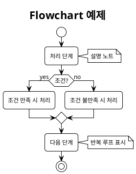
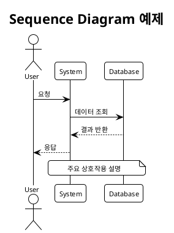
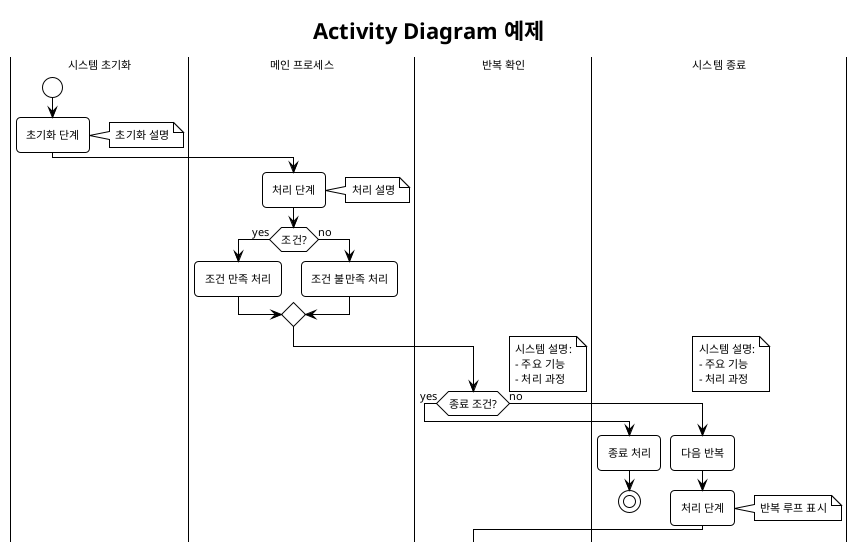
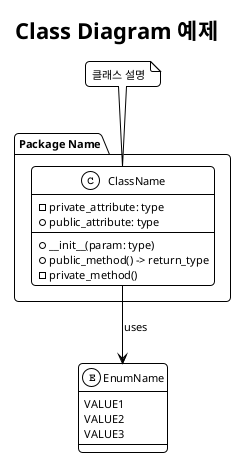

# Bybit Order Diagram 생성 가이드라인

이 문서는 MDP 기반 자동매매 시스템의 PlantUML 다이어그램 생성 시 발생할 수 있는 문법 오류와 올바른 해결 방법을 제공합니다.

## 📋 목차

1. [일반적인 PlantUML 문법 규칙](#일반적인-plantuml-문법-규칙)
2. [Flowchart Diagram 가이드라인](#flowchart-diagram-가이드라인)
3. [Sequence Diagram 가이드라인](#sequence-diagram-가이드라인)
4. [Activity Diagram 가이드라인](#activity-diagram-가이드라인)
5. [Class Diagram 가이드라인](#class-diagram-가이드라인)
6. [자주 발생하는 오류와 해결방법](#자주-발생하는-오류와-해결방법)
7. [다이어그램 생성 방법](#다이어그램-생성-방법)
8. [필수 반영 조건](#필수-반영-조건)

## 일반적인 PlantUML 문법 규칙

### 기본 구조


### 테마 및 스킨 설정
- `!theme plain`: 깔끔한 테마 적용
- `skinparam backgroundColor #FFFFFF`: 흰색 배경
- `skinparam defaultFontName Arial`: 기본 폰트 설정
- `skinparam defaultFontSize 11`: 기본 폰트 크기
- `skinparam roundcorner 8`: 모서리 둥글게

## Flowchart Diagram 가이어그램

### ✅ 올바른 문법


### ❌ 주의사항
- `backward` 문법 사용 금지
- 대신 `note right: 반복 루프 표시` 사용

## Sequence Diagram 가이어그램

### ✅ 올바른 문법


### ❌ 주의사항
- `note over`는 Sequence Diagram에서만 사용 가능
- Activity Diagram에서는 사용 금지
 - Sequence Diagram에서는 `loop` 구문 사용 가능 (예: `loop 설명` ... `end`)

## Activity Diagram 가이어그램

### ✅ 올바른 문법


### ❌ 주의사항
- `backward` 문법 사용 금지
- `note over |스윔레인|` 사용 금지
- `note right of |스윔레인|` 사용 금지
- 대신 `note right` 사용
 - `loop` 구문 사용 금지 (Activity에서는 지원되지 않음) → `repeat` ... `repeat while (조건) is (yes/no)` 사용

## Class Diagram 가이어그램

### ✅ 올바른 문법


### ❌ 주의사항
- 클래스명은 CamelCase 사용
- 메서드명은 snake_case 사용
- 속성과 메서드는 적절한 접근 제어자 표시

## 자주 발생하는 오류와 해결방법

### 1. backward 문법 오류
**오류 메시지**: `Cannot find repeat (Assumed diagram type: activity)`

**❌ 잘못된 사용**:
```plantuml
:다음 반복;
backward :처리 단계;
```

**✅ 올바른 사용**:
```plantuml
:다음 반복;
:처리 단계;
note right: 반복 루프 표시
```

### 2. note over 문법 오류 (Activity Diagram)
**오류 메시지**: `Syntax Error? (Assumed diagram type: activity)`

**❌ 잘못된 사용**:
```plantuml
note over |스윔레인|
  설명
end note
```

**✅ 올바른 사용**:
```plantuml
note right
  설명
end note
```

### 3. note right of 문법 오류
**오류 메시지**: `Syntax Error? (Assumed diagram type: activity)`

**❌ 잘못된 사용**:
```plantuml
note right of |스윔레인|
  설명
end note
```

**✅ 올바른 사용**:
```plantuml
note right
  설명
end note
```

### 4. Activity Diagram에서 loop 문법 오류
**오류 메시지**: `Syntax Error? (Assumed diagram type: activity)` 또는 특정 라인에서 액티비티 문이 바로 나오는 오류

**❌ 잘못된 사용 (Activity에서는 loop 미지원)**:
```plantuml
|학습 모드|
loop 100 에피소드
  :새로운 상태로 초기화;
  :학습 수행;
end
```

**✅ 올바른 사용 (`repeat` / `repeat while`)**:
```plantuml
|학습 모드|
repeat
  :새로운 상태로 초기화;
  :학습 수행;
repeat while (100 에피소드 완료?) is (no)
```

**✅ 거래 루프 반복 예시**:
```plantuml
:_trading_loop() 시작;
repeat
  :시장 데이터 수집;
  :상태/리스크 업데이트;
  :행동 선택 및 실행;
  :보상 계산 및 학습 업데이트;
repeat while (시스템 종료 신호?) is (no)
```

## 다이어그램 생성 방법

### 1. PlantUML JAR 파일 사용
```bash
# PlantUML JAR 파일 다운로드
wget https://github.com/plantuml/plantuml/releases/download/v1.2023.10/plantuml-1.2023.10.jar

# PNG 이미지 생성
java -jar plantuml.jar diagram_name.puml

# SVG 이미지 생성
java -jar plantuml.jar -tsvg diagram_name.puml
```

### 2. 온라인 도구 사용
- [PlantUML Online Server](http://www.plantuml.com/plantuml/uml/)
- .puml 파일 내용을 복사하여 붙여넣기

### 3. VS Code 확장 프로그램
1. PlantUML 확장 설치
2. Java 런타임 환경 확인
3. `Alt+Shift+D` (Windows) 또는 `Option+Shift+D` (Mac)로 미리보기


## 필수 반영 조건

아래의 조건을 반드시 반영하여 플로우차트, 시퀀스차트, 액티비티다이어그램을 생성해야 합니다.

### 1. **함수 호출 흐름**
   - 함수/메서드가 호출되는 순서와 관계를 명확히 표현할 것
   - 실제 코드의 함수 호출이 누락 없이 다이어그램에 반영되어야 함

### 2. **각 단계별 실제 코드의 수식**
   - 주요 연산, 수식, 변수 계산(예: `buy_price = current_price - (0.1 * 2)`)을 다이어그램 내 노트 또는 주석으로 명확히 표기할 것
   - 수식이 코드에 존재한다면 반드시 다이어그램에 반영할 것

### 3. **조건문(입력값 검증, 가격 비교 등)**
   - 입력값 검증, 가격 비교, 분기 등 실제 코드의 조건문을 다이어그램 내에 명확히 반영할 것
   - 조건문의 분기 결과(예: 예/아니오, 참/거짓 등)도 시각적으로 표현할 것
   - 예외 처리(try/except 등)도 흐름에 맞게 다이어그램에 포함할 것

### 4. **변수 변화**
   - 주요 변수의 값 변화(예: `order_price`, `current_price` 등)를 다이어그램 내에서 추적 가능하도록 노트 또는 주석으로 표기할 것
   - 변수의 초기화, 갱신, 저장, 반환 등 모든 변화 과정을 다이어그램에 명확히 드러낼 것

### 5. **코드의 주요 초기화 과정**
   - 클래스/함수/전략 객체 생성 시 내부적으로 수행되는 주요 초기화(지표 계산, 데이터 준비 등)를 다이어그램 내에 반드시 반영할 것
   - 예: `init()`에서의 지그재그, 볼린저 밴드, 이동평균선 등 주요 지표 계산 및 변수 초기화

### 6. **함수 호출 조건과 함수 반환 이후 변화되는 데이터나 변수**
   - 각 함수/메서드 호출 시, 호출 조건(예: if문, 상태 등)과 호출 후 변화되는 데이터/변수(예: 포지션 생성, 변수 값 변경 등)를 노트 또는 주석으로 명확히 표기할 것
   - 함수 반환 이후의 상태 변화, 데이터 저장, 결과값 생성 등도 반드시 다이어그램에 반영할 것

### 7. **액티비티 다이어그램의 영역(스윔레인, Swimlane) 구분**
   - 플로우 차트와 액티비티 다이어그램을 작성할 때는 `|사용자|`, `|PositionTracker|` 등과 같이 각 주체(사용자, 클래스, 외부 시스템 등)별로 스윔레인(영역)을 명확히 구분하여 표기할 것
   - 각 영역 내에서 해당 주체가 수행하는 액티비티만 배치하여, 책임과 흐름을 시각적으로 명확히 할 것

### 8. **가독성을 위한 노트(note) 적극 활용**
   - 복잡한 연산, 조건, 변수 변화, 함수 호출 결과, 예외 처리 등은 반드시 노트(note right/left 등)로 상세하게 설명하여 가독성을 높일 것
   - 다이어그램만 봐도 실제 코드의 흐름과 상태 변화를 쉽게 이해할 수 있도록 할 것

### 9. **실제 코드의 모든 주요 내용 누락 금지**
   - 다이어그램에는 실제 코드의 모든 주요 흐름, 조건, 변수 변화, 예외 처리, 반환값, 상태 변화 등이 빠짐없이 반영되어야 함
   - 코드와 다이어그램이 불일치하지 않도록 항상 최신 코드를 기준으로 다이어그램을 작성/수정할 것

### 10. **각 함수의 내부 로직 상세 표현**
   - 각 함수의 내부 로직을 다이어그램에 표현할 때, 의사코드(알고리즘 단계별 의미), 핵심 조건/분기/변수 변화까지 상세히 표현해야 함
   - 단순 코드 나열이 아니라, 각 단계의 의미와 분기, 변수 변화, 반환값 등을 가독성 있게 요약·설명하는 방식으로 작성할 것
   - 복잡한 함수일수록 단계별 의미와 흐름을 명확히 드러내야 하며, 주요 분기/조건/변수 변화는 반드시 시각적으로 구분할 것

## 검증 체크리스트

다이어그램 생성 후 다음 사항을 확인하세요:

### 문법 검증
- [ ] `backward` 문법이 사용되지 않았는가?
- [ ] Activity Diagram에서 `note over` 또는 `note right of`가 사용되지 않았는가?
- [ ] Activity Diagram에서 `loop` 대신 `repeat ... repeat while`을 사용했는가?
- [ ] 모든 다이어그램이 올바른 `@startuml`과 `@enduml`로 감싸져 있는가?
- [ ] 테마와 스킨 설정이 일관되게 적용되었는가?
- [ ] 한글 텍스트가 올바르게 표시되는가?

### 내용 검증
- [ ] 함수 호출 흐름이 명확히 표현되었는가?
- [ ] 주요 수식과 변수 계산이 노트로 표기되었는가?
- [ ] 조건문과 분기가 명확히 표현되었는가?
- [ ] 변수 변화가 추적 가능하도록 표기되었는가?
- [ ] 초기화 과정이 포함되었는가?
- [ ] 함수 호출 조건과 반환 후 변화가 표기되었는가?
- [ ] 스윔레인이 적절히 구분되었는가?
- [ ] 복잡한 로직이 노트로 설명되었는가?
- [ ] 실제 코드와 일치하는가?
- [ ] 함수 내부 로직이 상세히 표현되었는가?

## 참고 자료

- [PlantUML 공식 문서](https://plantuml.com/)
- [PlantUML 문법 가이드](https://plantuml.com/guide)
- [다이어그램 예제 모음](https://plantuml.com/examples)

---

> 이 가이드라인은 src 내 모든 다이어그램(PlantUML, Mermaid 등) 작성 시 반드시 준수해야 합니다.

**마지막 업데이트**: 2024년
**버전**: 2.0.0
**작성자**: AI Assistant 